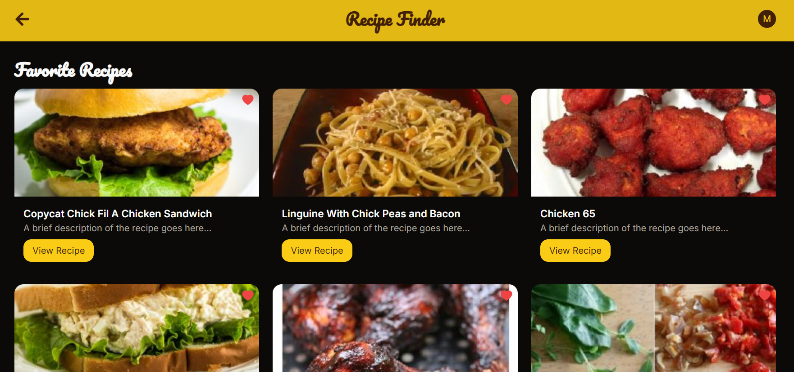

---
## Frontend - Recipe Finder

### Overview

This is the frontend application for the Recipe Finder project. It is built using Next.js and TailwindCSS. The application allows users to search for recipes, view recipe details, and manage their favorite recipes. It also supports authentication via Google and email/password.

### Tech Stack

- **Next.js**: React framework for server-side rendering and static site generation.
- **TailwindCSS**: Utility-first CSS framework for styling.
- **Redux**: State management tool used with Redux Persist to persist state across sessions.
- **Axios**: Promise-based HTTP client for the browser and Node.js.
- **React Query**: Data-fetching library to handle server-state in React applications.

### Features

- **Recipe Search**: Search for recipes by ingredients or dish name.
- **Recipe Details**: View detailed information about recipes, including ingredients and instructions.
- **Favorites Management**: Add or remove recipes from favorites.
- **Authentication**: Supports Google login and email/password login.
- **Responsive Design**: Fully responsive for mobile and desktop views.

### Installation

1. **Clone the repository**:

   ```bash
   git clone https://github.com/your-username/recipe-finder-frontend.git
   cd recipe-finder-frontend
   ```

2. **Install dependencies**:

   ```bash
   npm install
   ```

3. **Environment Variables**:

   Create a `.env.local` file in the root directory and add the following:

   ```bash
   NEXT_PUBLIC_GOOGLE_CLIENT_ID=your-google-client-id
   NEXT_PUBLIC_GOOGLE_CLIENT_SECRET=your-google-client-secret
   NEXT_PUBLIC_API_URL=http://localhost:5000
   ```

4. **Run the application**:

   ```bash
   npm run dev
   ```

   The application will be running at `http://localhost:3000`.

### Folder Structure

- **`/components`**: Reusable React components.
- **`/pages`**: Next.js pages and API routes.
- **`/redux`**: Redux slices and store configuration.
- **`/styles`**: Global and component-specific styles.
- **`/hooks`**: Custom hooks, including debounce.

### Usage

- **Search for Recipes**: Use the search bar to find recipes by ingredients or dish name.
- **View Recipe Details**: Click on a recipe to view detailed instructions and ingredients.
- **Manage Favorites**: Click the heart icon on a recipe card to add or remove it from your favorites.
- **Authenticate**: Use Google login or sign in with your email and password.

### Deployment

To deploy the frontend application:

1. **Build the application**:

   ```bash
   npm run build
   ```

2. **Start the application**:

   ```bash
   npm start
   ```

### Contributing

1. Fork the repository.
2. Create your feature branch (`git checkout -b feature/fooBar`).
3. Commit your changes (`git commit -am 'Add some fooBar'`).
4. Push to the branch (`git push origin feature/fooBar`).
5. Create a new Pull Request.

### License

This project is licensed under the MIT License.

### Images of This project





---